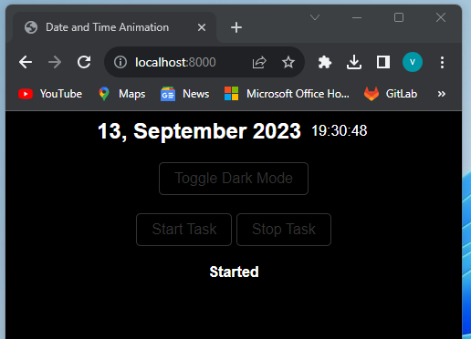

# Code Demo - Async, FastAPI, and WebUI

This code demo showcases the usage of asynchronous programming, FastAPI framework, and serving a web user interface (WebUI) using async FastAPI.

The main components of the code demo are:

main.py

This file contains the main code for the FastAPI application. It defines a MyClass class that has methods to start and stop a task that prints "Hello World" every second. The FastAPI application has three endpoints:

/start: When called, it starts the task if it is not already running.

/stop: When called, it stops the running task.

/: This is the root endpoint that returns the contents of the index.html file.

index.html

This file contains an HTML document that displays the current date and time. It uses JavaScript to update the date and time every second.
It also has buttons that can access the start and stop endpoints and display their responses. 

The application uses the uvicorn server to run the FastAPI application on http://0.0.0.0:8000.

To run the code demo, execute the main.py file.

Please note that this code demo is a simplified example and may not include all the necessary error handling or production-ready features. It serves as a starting point for understanding how to use async programming, FastAPI, and serve a web user interface using async FastAPI.
